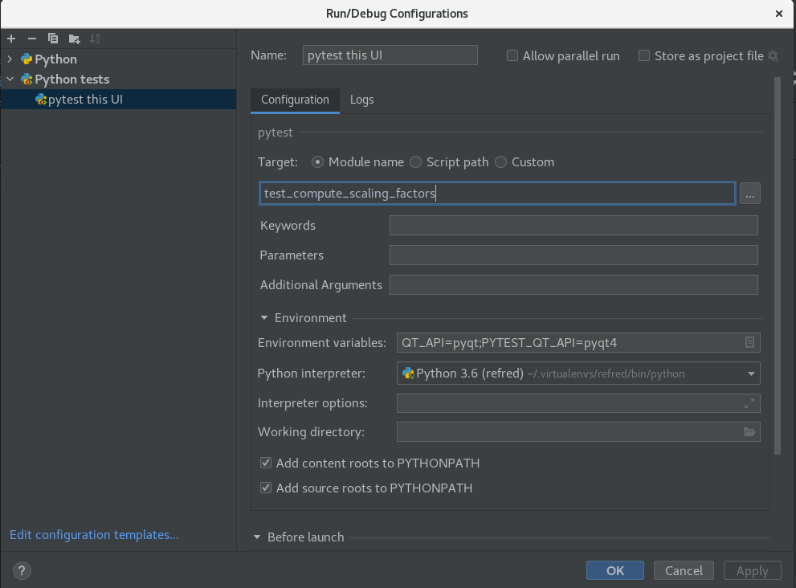

=======================
Developing with Pycharm
=======================

Running UI Tests
----------------
Create a pytest configuration setting environment variables
``QT_API`` and ``PYTEST_QT_API``. In the figure below, we set
these variables to work with PyQt5.

