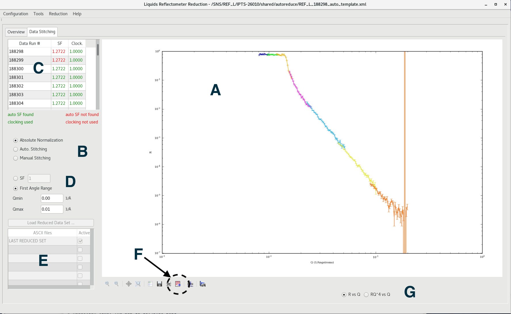

Reducing data using RefRed
--------------------------

This use-case describes how the user interacts with RefRed once their reduction
options have been chosen.

1- Load a template according to the corresponding `use case <load-template.rst>`_. Note that it takes a minute or so to load all the data.

2- Click the "reduce" button at the bottom of the interface (see the image in this `use case <load-template.rst>`_ to locate the reduce button).
   Once the reduction starts, the user will be brought to the "data stitching"
   tab (see image). As the reduction proceeds, each data set will be added
   to the plot (item A).

3- Item B allows the user to select one of three normalization schemes.
The default is `Absolute normalization`. This uses predetermined scaling
constants to multiply each run. This process is done as part of the reduction,
and for our purpose here it just displays the output of the reduction.

Additional options that are rarely used:
  - The `Auto. Stitching` option will perform a fit of the overlap region of
consecutive runs to determine a relative scaling factor. This option is rarely
used.

  - The `Manual Stitching` option allows the user to enter scaling factors by hand.
This option is never used.

4- Item D allows the user to renormalize the whole curve (each run is then multiplied
by the same scaling factor). Picking the `SF` option allows you to pick that
scaling factor, while the `First Angle Range` (which is badly named), will renormalize
the R(Q) in the range between `Qmin` and `Qmax` to 1.

5- The list of runs is shown on the table (Item C). The `SF` column shows
the scaling factor that each curve was multipled by as part of the process,
according to the options selected in Items B and D.

6- Item E is puzzling and nobody knows what it does. It should be removed.

7- Item G allows the plot to change from R vs Q to RQ^4 vs Q.

8- Item F is very important. Clicking that icon will pop up a dialog to
save the R(q) output in a format that can be used in fitting applications.
The output for the template in this use-case is in
`docs/data/REFL_188298_reduced_data.txt`.

9- The items left of Item F are semi-standard toolbar tools. The items on the
right are meant to switch between linear and log scale. They don't behave very well.
