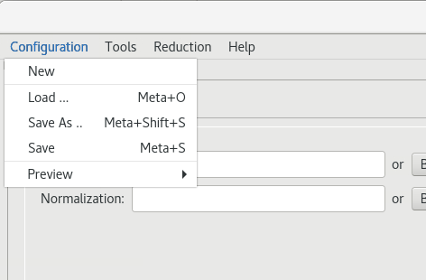
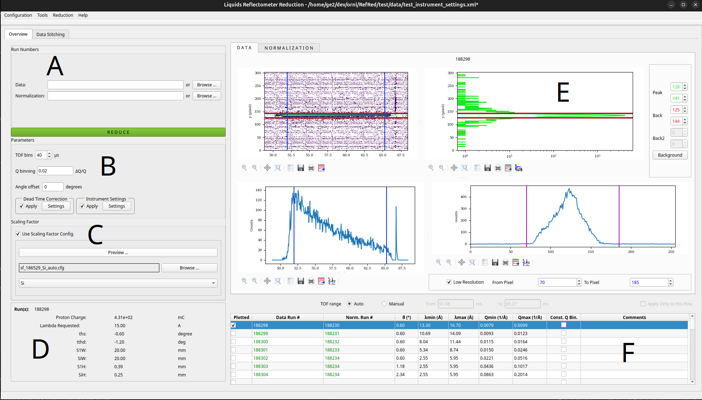

Load previous reduction from template
-------------------------------------

This is the main use case for users. Since most of the data is
automatically reduced, the main task that a user will want to do
is to load the data that was automatically reduced, along with the
options used for reduction. This allows the user to inspect these
options and modify them as needed.

1- From the `Configuration` menu, select the `Load...` item to pick
a template file (see image).
Select `/SNS/REF_L/IPTS-26010/shared/autoreduce/REF_L_188298_auto_template.xml`.

2- Once a template is selected, RefRed will load all the necessary files
to proceed. There are several widgets on the UI. These are labeled with
on the image below as follows:

  A: Item A allows the user to enter or browse for data and normalization files.

  B: Item B allows the user change a number of reduction parameters, including:

    - the TOF binning and output Q binning
    - the calibration angle offset, which is given by the instrument scientist
    - the dead time correction settings
    - the instrument geometry parameters

  C: Item C allows the user to pick a scaling factor file.

  D: Panel D give basic information about the reflected run.

  E: Each reflected run needs a normalization run (R is the ratio of the
  reflected beam and the direct beam). For this reason the main area of
  the UI is presented as two tabs, one for the reflected data (called Data),
  and one for the normalization (called Normalization). They both
  present the same view and serve the same purpose.

  The main area of the UI displays four plots: a 2D plot of y pixel vs TOF,
  a projection of the counts in x, a  projection of the counts in y, and
  a TOF distribution.

  The lines shown on each plot are selection ranges. For the purpose of
  this use-case, only the peak selection on the right-most plots are used.
  They allow to pick the peak (left and right bounds) and the background
  range (left and right bounds). The also allow to select a so-called
  clocking range, which is an option we would like to remove.

  Double-clicking on the y vs counts plot will pop up a larger plot that
  makes it easier to visualize and select the peak.

  F: The loaded files are listed in the table. The run numbers in green
  are editable. The user can click these numbers and change them to use
  the current template as a starting point.

  The check boxes on the left of the table allow the user to populate
  the main area of the UI (item E).

Once the user inspects these items, the user can either save the
template (using the `Configuration` menu shown above) or click
the `Reduce` button at the bottom of the screen.

**Success path**
For the purpose of this use-case, we will call the use-case successful
if we can save the configuration and load it back.
